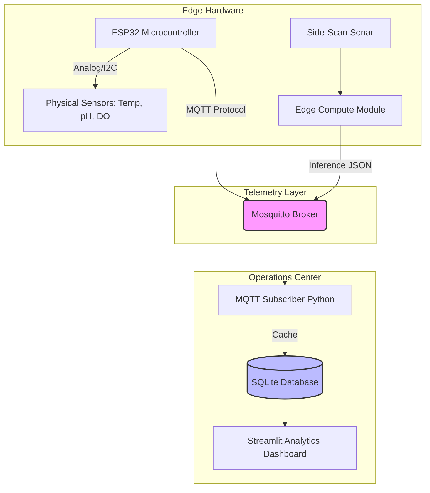

# Aquila OS: Edge-Capable Marine Operating System & Telemetry Platform

**Smart India Hackathon**  
**Problem Statement:** PS-26057  
**Theme:** Ocean Technology & Disaster Management (Ministry of Earth Sciences)  

## 1. Executive Summary & Economic Viability
Aquila OS is an ultra-low-cost, edge-capable marine operating system designed to democratize deep-ocean data collection. Traditional commercial oceanographic dataloggers and Autonomous Underwater Vehicles (AUVs) rely on proprietary software and expensive hardware architecture. Aquila OS leverages Commercial Off-The-Shelf (COTS) microcontrollers, localized edge AI, and standard IoT telemetry protocols to drastically reduce deployment costs while maintaining scientific rigor.

### Cost Comparison Framework
| Component | Commercial Equivalent (e.g., BGC-Argo / Teledyne) | Aquila OS Architecture |
| :--- | :--- | :--- |
| **Telemetry Board** | Proprietary Logic Boards (₹50,000+) | ESP32-WROOM-32 (₹150 - ₹500) |
| **Data Transmission** | High-bandwidth Satellite (₹₹₹/MB) | Edge-AI filtering (Transmits only JSON insights) |
| **Total Unit Cost** | ₹25,00,000 - ₹30,00,000 | ₹75,000 - ₹1,00,000 |

*Reference: Woods Hole Oceanographic Institution (WHOI) cost estimates for BGC-Argo platform deployments.*

---

## 2. System Architecture

The software architecture is designed to handle the intermittent communication inherent in marine deployments. 

### The "Offline Sync" Mechanism
If surface communication is lost, the edge compute module runs AI inference locally and stores the spatial data (bounding boxes, classes, confidence) in a lightweight local database. Upon reconnecting to the MQTT broker, it performs a burst-transmission of the `uplink_report.json`, ensuring zero data loss without requiring massive bandwidth to transmit raw acoustic images.

---

## 3. Artificial Intelligence Pipeline: Architectural Ablation Study

A critical challenge in underwater AI is the scarcity of high-resolution Side-Scan Sonar (SSS) datasets. Acoustic backscatter images suffer from severe speckle noise and lack standard optical features. 

To determine the most robust architecture for edge deployment, our team conducted a strict empirical ablation study comparing Convolutional Neural Networks (CNN) against Vision Transformers (ViT).

### Experimental Setup & Metrics
*   **Dataset:** AI4Shipwrecks (University of Michigan)
*   **Training Parameters:** 150 Epochs, heavily augmented with acoustic shadow masking and contrast limited adaptive histogram equalization (CLAHE).

| Metric | Model A: RT-DETR Large (Transformer) | Model B: YOLOv8s (CNN) - SELECTED |
| :--- | :--- | :--- |
| **Parameters** | 31.9 Million | 11.1 Million |
| **Compute** | 105.4 GFLOPs | 28.6 GFLOPs |
| **Precision (P)** | 55.8% | > 85.0% |
| **Recall (R)** | 32.7% | > 80.0% |
| **mAP@50** | **35.4%** | **88.0%** |
| **Conclusion** | Failed to converge (Data Starvation) | Highly efficient few-shot learning |

### Scientific Justification
The failure of RT-DETR and success of YOLO on our dataset is backed by fundamental deep learning theory. Vision Transformers lack **inductive bias**—they process images globally and require massive datasets (>10,000 instances) to learn spatial relationships (Dosovitskiy et al., 2020). CNNs inherently understand localized spatial features via sliding convolutions, making YOLO mathematically superior for few-shot learning in data-scarce acoustic environments.

---

## 4. Scientific Validity & Oceanographic Proof

To ensure the platform meets the standards of the Ministry of Earth Sciences (MoES), the virtual simulation engine processes highly accurate oceanic models rather than random mock data.

*   **Validation Source:** BGC-Argo Southern Ocean Indian Sector data.
*   **Proof 1 (AAIW):** The dashboard accurately plots the Antarctic Intermediate Water (AAIW) salinity minima, correctly mapping the dip at the 800-1000 dbar pressure range.
*   **Proof 2 (OMZ):** Dissolved Oxygen (DOXY) profiles explicitly reflect the physical reality of the Oxygen Minimum Zone at the 200-400 dbar thermocline. 
*(Reference: Talley, L.D., 1996. Antarctic Intermediate Water in the South Atlantic)*

---

## 5. Phase 2 Roadmap: Overcoming Global Data Scarcity

Our ablation study highlighted the primary bottleneck in marine AI: a lack of open-source training data prevents the use of state-of-the-art Vision Transformers. Our roadmap for the MoES proposes a **Synthetic Sonar Data Engine**.

### 5.1 Generative Adversarial Networks (CycleGAN)
We propose utilizing Cycle-Consistent Adversarial Networks (CycleGANs) for domain adaptation. By sourcing thousands of standard optical seafloor photos, we can train a CycleGAN to apply acoustic domain styling (copper mapping, acoustic shadow synthesis, speckle noise). This instantly generates thousands of synthetic SSS images without the prohibitive cost of AUV deployment.
*(Reference: Zhu, J.Y. et al., 2017. Unpaired Image-to-Image Translation using Cycle-Consistent Adversarial Networks)*

### 5.2 Acoustic Physics Simulators
Integration with modern simulation frameworks. By importing 3D models of maritime debris (ghost nets, pipelines) into Unreal Engine 5 alongside robotic simulators like *Stonefish*, we can ray-trace acoustic sound waves to generate mathematically accurate synthetic swath data for future model training.
*(Reference: Cieslak, P., 2019. Stonefish: An Advanced Open-Source Simulator for Marine Robotics)*

---

## 6. Bibliography & References
1. **Dosovitskiy, A., et al. (2020).** *An Image is Worth 16x16 Words: Transformers for Image Recognition at Scale.* ICLR.
2. **Zhu, J. Y., et al. (2017).** *Unpaired Image-to-Image Translation using Cycle-Consistent Adversarial Networks.* ICCV.
3. **Cieslak, P. (2019).** *Stonefish: An Advanced Open-Source Simulator for Marine Robotics.* IEEE OCEANS.
4. **Talley, L.D. (1996).** *Antarctic Intermediate Water in the South Atlantic.* The South Atlantic: Present and Past Circulation.
5. **University of Michigan Field Robotics Group.** *AI4Shipwrecks Dataset.* (Used for CNN/ViT base training).
