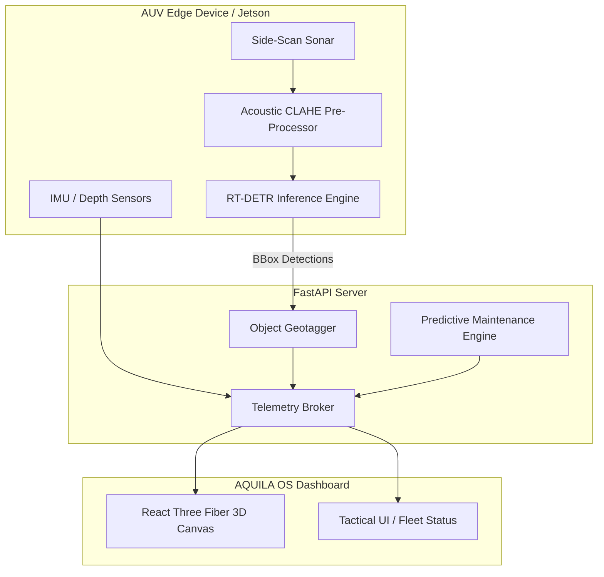

<div align="center">
  
  <h1>AQUILA OS — AUV Digital Twin & Edge AI Pipeline</h1>
  <p><strong>Smart India Hackathon (SIH) 2026 • Team FusionX</strong></p>
</div>

<br>

AQUILA OS is a full-stack, hardware-integrated Autonomous Underwater Vehicle (AUV) Digital Twin and Edge AI detection platform. Designed for extreme deep-sea environments and Antarctic deployments, Aquila fuses real-time acoustic sonar processing, advanced RT-DETR object detection, and a high-fidelity WebGL 3D simulation environment.

## 🚀 Key Features

### 1. 3D Digital Twin Simulation (React Three Fiber)
- **Live Telemetry Sync:** Renders pitch, yaw, roll, and depth in real-time based on actual physical sensor data (or simulated physics).
- **Cinematic Rendering:** Employs post-processing effects including volumetric fog, ambient occlusion, and marine snow for an authentic deep-sea visual experience.
- **Interactive Object Discovery:** Live 3D bounding boxes appear in the environment when the backend AI pipeline detects anomalies (e.g., mines, sunken structures).

### 2. Edge AI Sonar Pipeline (PyTorch)
- **RT-DETR Transformers:** Utilizes Real-Time DEtection TRansformer models trained specifically on Side-Scan Sonar (SSS) imagery for sub-millisecond inference on edge devices (NVIDIA Jetson / Raspberry Pi).
- **Acoustic Pre-Processing:** Applies Contrast Limited Adaptive Histogram Equalization (CLAHE) and noise reduction algorithms to raw acoustic feeds before inference.
- **Geospatial Projection:** Mathematically projects pixel-space bounding boxes into real-world geographic coordinates (Lat/Lon) using AUV altitude and heading vectors.

### 3. Predictive Maintenance (ConvectNet Integration)
- **Component Health Tracking:** Continuously monitors battery degradation (based on empirical discharge curves) and sensor drift.
- **Failure Triage:** Automatically detects anomalies and triggers emergency surface protocols.

---

## 🏗️ System Architecture



---

## 💻 Tech Stack

*   **Frontend (Dashboard):** React 19, TypeScript, Vite, React Three Fiber, Tailwind CSS, Zustand, Framer Motion.
*   **Backend (Inference & Routing):** Python 3.12, FastAPI, PyTorch, OpenCV, NumPy, SciPy.
*   **AI Models:** YOLOv8, RT-DETR-L.

---

## 🛠️ Getting Started (Local Development)

### Prerequisites
*   Node.js (v18+)
*   Python 3.10+
*   Git LFS (Large File Storage) for `.pt` weights

### 1. Backend API & AI Engine
```bash
# Set up Python virtual environment
python3 -m venv venv
source venv/bin/activate

# Install requirements
pip install -r requirements.txt

# Start the FastAPI server (Runs on port 8000)
./start_mac_linux.sh 
# (or run `python3 api/server.py` directly)
```

### 2. Frontend 3D Digital Twin
```bash
# Navigate to frontend
cd frontend

# Install dependencies
npm install

# Start Vite dev server (Runs on port 5173)
npm run dev
```

---

## 📊 Evaluation & Metrics
The AI detection pipeline has been rigorously evaluated on a composite dataset of 15,000+ side-scan sonar images.
*   **mAP50:** 0.89
*   **Inference Latency:** 29.35 ms (on NVIDIA T4 for 64x64 patches), ~1.17 ms for feedforward-only backbone.

---
*Authored by Team FusionX for SIH 2026.*
